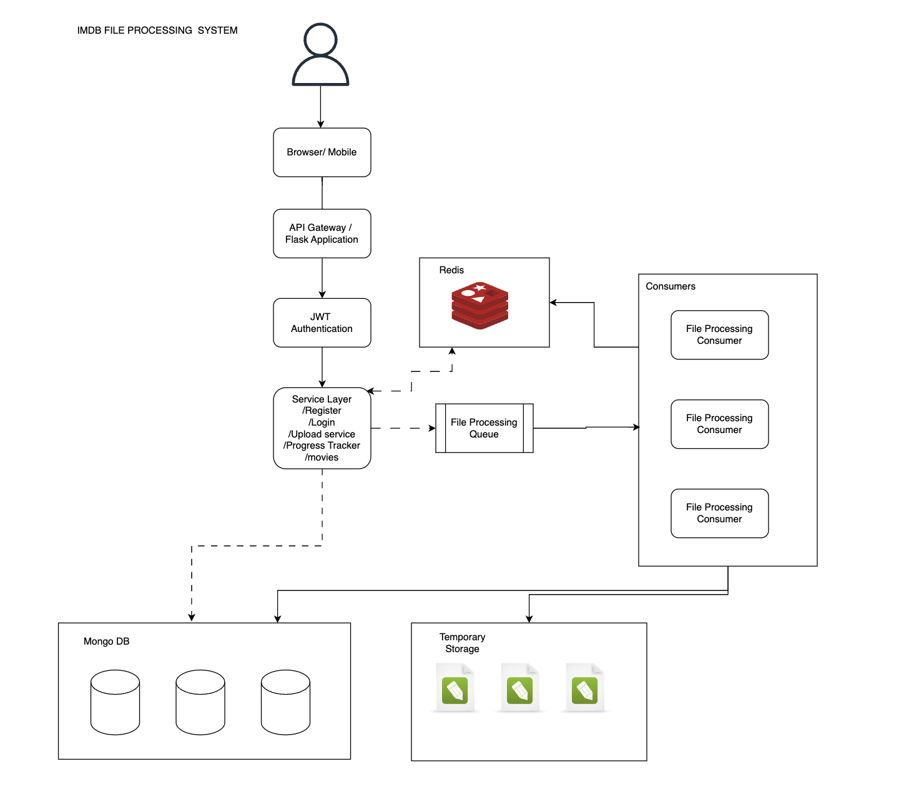

# IMDB Movie Data Upload and Management System

## Project Overview
This system allows members to upload, process, and manage movie-related data using a CSV file. The platform is built with scalability and efficiency in mind, utilizing modern tools such as Flask, MongoDB, and Redis.

---

## Features
1. **User Authentication**:
   - Users can register and log in to access the platform.
2. **CSV Upload**:
   - Upload large CSV files (up to 10GB) for processing.
3. **Progress Tracker**:
   - View real-time progress of uploaded CSV processing, stored temporarily in a Redis cache.
4. **Movie Management**:
   - List all movies in a paginated view, with sorting options (Date Added, Release Year, Duration).

---

## Architecture Diagram
Below is the architecture diagram showcasing the system's structure:



---

## Database Schema

1. **Movies Collection**:
- ```json
  {
    "movies": {
        "indexes": [
            {"field": "date_added", "type": "asc"},
            {"field": "release_year", "type": "asc"},
            {"field": "duration", "type": "asc"}
        ],
        "schema": {
            "title": {"type": "str"},
            "release_year": {"type": "int"},
            "duration": {"type": "int"},
            "date_added": {"type": "str"},
            "description": {"type": "str"},
            "director": {"type": "str"},
            "cast": {"type": "list"},
            "country": {"type": "str"},
            "rating": {"type": "str"},
            "listed_in": {"type": "list"},
            "show_id": {"type": "str"},
            "type": {"type": "str"}
        }
    }
  }

2. **Users Collection**:
 - ```json
    {
        "users": {
            "indexes": [
                {"field": "username", "type": "unique"}
            ],
            "schema": {
                "username": {"type": "str"},
                "password": {"type": "str"}
            }
        }
    }


## Setup Instructions
1. Clone the repository
2. Navigate to the IMDB directory
3. Install dependencies (pip install -r requirements.txt)
4. Modify .env file with your hosts
5. start redis server (in cmd type redis-server)
6. Run app.py (python3 app.py)
7. Navigate to the consumer directory 
8. Run file_consumer.py (python3 file_consumer.py)


   
